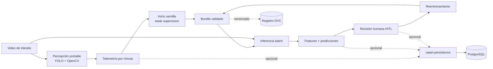

# VAAET — Video Advanced Analysis of Traffic

[](https://github.com/zgfnicolas/vaaet/actions/workflows/ci.yml)
[](vaaet-core/pyproject.toml)
[](LICENSE)

Monorepo de visión artificial y MLOps para convertir videos de tránsito en
telemetría por minuto, estados de circulación y evidencia revisable por una
persona. El caso de estudio actual es el Puente General Manuel Belgrano.

> **Estado actual:** VAAET es un laboratorio ML con procesamiento batch en
> Google Colab. Sus bundles pueden estar en etapa `pilot`, `candidate` o
> `production`, pero sólo una evaluación humana y los gates documentados pueden
> promoverlos. No es un sistema autónomo de seguridad ni una herramienta de
> respuesta ante emergencias. La API y la Web App todavía no están implementadas.

## Qué hace VAAET

- Detecta y clasifica autos, camiones, colectivos, motocicletas y bicicletas.
- Sigue vehículos y estima velocidades aproximadas a partir del video.
- Genera un video anotado y telemetría cruda por ventanas completas de un minuto.
- Construye 19 features contractuales para describir volumen, composición,
  variación, persistencia y calidad de la medición.
- Entrena un MLP para reconocer `Normal`, `Reduced` y `Congested`.
- Señala posibles incidentes para revisión; `Accident` nunca es una salida
  automática y requiere confirmación humana.
- Conserva datasets, holdouts, input locks y bundles reproducibles para el ciclo
  de mejora con Human-in-the-Loop (HITL).

## Demostración visual

La demostración pública está pendiente de publicación. No se mantiene un enlace
de muestra ficticio: mientras tanto, los cuatro notebooks reproducibles permiten
recorrer adquisición, entrenamiento, inferencia y evaluación en Google Colab.

## Inicio rápido

### Google Colab — recomendado

No necesitás instalar el proyecto en tu equipo. Abrí el workflow que corresponda
y seguí sus recetas iniciales; cada notebook instala `vaaet-core`,
`vaaet-persistence` y luego `vaaet-ml` dentro del runtime efímero.

| Objetivo | Notebook | Requisito principal |
|---|---|---|
| Obtener telemetría cruda y video anotado | [Abrir recolección en Colab](https://colab.research.google.com/github/zgfnicolas/vaaet/blob/main/vaaet-ml/notebooks/data-collection/collect_traffic_telemetry.ipynb) | Video MP4; 60 s para la primera fila |
| Crear el modelo semilla o reentrenar con HITL | [Abrir entrenamiento en Colab](https://colab.research.google.com/github/zgfnicolas/vaaet/blob/main/vaaet-ml/notebooks/training/train_traffic_state_classifier.ipynb) | Backup/CSV raw o catálogo HITL |
| Analizar un video con un bundle | [Abrir inferencia en Colab](https://colab.research.google.com/github/zgfnicolas/vaaet/blob/main/vaaet-ml/notebooks/inference/analyze_traffic_video.ipynb) | MP4 + bundle válido; 2 min para el primer estado |
| Comparar Champion y Challenger | [Abrir evaluación en Colab](https://colab.research.google.com/github/zgfnicolas/vaaet/blob/main/vaaet-ml/notebooks/evaluation/evaluate_models_and_eda.ipynb) | Dos bundles compatibles + holdout declarado |

PostgreSQL, Google Drive y la revisión HITL son opcionales y permanecen
deshabilitados hasta que la configuración del notebook los active explícitamente.
Consultá la [guía de Colab](docs/operations/colab-guide.md) antes de configurar
Secrets, GPU o persistencia.

### Instalación local

Requiere Python 3.10–3.13. Desde la raíz del monorepo:

```bash
git clone https://github.com/zgfnicolas/vaaet.git
cd vaaet

python -m venv .venv
# PowerShell: .\.venv\Scripts\Activate.ps1
# Bash/Zsh:   source .venv/bin/activate

python -m pip install --upgrade pip
python -m pip install -e "./vaaet-core[vision,inference,dev]"
python -m pip install -e "./vaaet-persistence[admin,dev]"
python -m pip install -e "./vaaet-ml[training,evaluation,visualization,database,dev]"
python -m pip check
```

Instalá sólo los extras necesarios si vas a utilizar el core portable o un
workflow específico. Las instrucciones detalladas viven en los README de
[`vaaet-core`](vaaet-core/README.md) y [`vaaet-ml`](vaaet-ml/README.md).

## Cómo funciona



El primer bundle puede aprender de reglas provisionales y datos sintéticos
controlados. Los ciclos posteriores consumen features ya calculadas y
validaciones humanas; la influencia de las etiquetas proxy disminuye a medida
que existe soporte humano por clase. Cada entrenamiento sigue siendo un
candidato hasta superar una evaluación comparable sobre un holdout congelado.

## Arquitectura del monorepo

| Componente | Responsabilidad | Interfaz y límites |
|---|---|---|
| [`vaaet-core/`](vaaet-core/README.md) | Percepción, telemetría, 19 features, política de estados y carga segura del bundle | Distribución `vaaet-core`, import `vaaet`; no accede a PostgreSQL, DVC, Drive ni notebooks |
| [`vaaet-persistence/`](vaaet-persistence/README.md) | Configuración, consultas, escrituras, auditoría y migraciones PostgreSQL | Distribución `vaaet-persistence`, import `vaaet_persistence`; consume sólo el core base y sirve a notebooks o backends |
| [`vaaet-ml/`](vaaet-ml/README.md) | Notebooks, datasets, entrenamiento, evaluación, adaptadores Colab y artefactos ML | Distribución `vaaet-ml`, import `vaaet_ml`; consume core/persistencia y no se usa para serving |
| [`vaaet-app/`](vaaet-app/README.md) | Frontera reservada para una futura API y Web App | No contiene aplicación ejecutable; la Web futura sólo podrá consumir una API HTTP versionada |
| [`docs/`](docs/index.md), [`.dvc/`](.dvc) y [`.github/`](.github) | Decisiones, contratos, registro de modelos y automatización compartida | Un único Git, una única raíz DVC y CI común |

La separación está gobernada por
[ADR-0021](docs/architecture/decisions/0021-portable-core-and-ml-laboratory-boundary.md)
y [ADR-0028](docs/architecture/decisions/0028-shared-postgresql-persistence-layer.md).
Una futura API deberá validar el manifiesto antes de deserializar el modelo,
usar `vaaet-core` y acceder a PostgreSQL mediante `vaaet-persistence` con una
identidad propia; nunca podrá importar el laboratorio ML.

## Workflows disponibles

| Workflow | Entrada | Resultado |
|---|---|---|
| **Recolección** | Video MP4 | Video anotado, CSV raw y persistencia opcional en `vaaet_raw` |
| **Entrenamiento** | Telemetría raw, snapshot semilla y/o feedback humano validado | Métricas, training input lock y bundle de cuatro archivos |
| **Inferencia** | Video + bundle autorizado | Video anotado, telemetría, estados, posibles incidentes y revisión HITL opcional |
| **Evaluación** | Champion, Challenger y benchmark compatible | Comparación read-only, métricas emparejadas y diagnóstico de drift |

La evaluación no promociona modelos ni escribe en PostgreSQL, DVC o artefactos.
La decisión de promoción es explícita y humana.

## Modelo y contrato de inferencia

El clasificador tabular utiliza 19 features en un orden contractual fijo y una
arquitectura MLP de tres salidas: `Normal`, `Reduced` y `Congested`. La política
posterior aplica calibración, umbrales, transiciones adyacentes e histéresis para
reducir oscilaciones y falsos positivos.

El bundle contiene exactamente:

```text
traffic_classifier.keras
feature_scaler.joblib
label_mapping.joblib
model-manifest.json
```

El manifiesto se valida antes de cargar los binarios. Registra features,
versiones, checksums, procedencia, política de entrada, métricas, elegibilidad y
el input lock utilizado. Los aproximadamente 2.068 registros históricos permiten
iniciar un modelo piloto, pero no demuestran calidad de producción sin telemetría
moderna suficiente, diversidad operacional y un holdout humano.

Más información en el [contrato del bundle](docs/ml/model-artifact-contract.md)
y la [model card](docs/ml/model-card.md).

## Stack tecnológico

| Área | Tecnologías | Uso en VAAET |
|---|---|---|
| Runtime | Python 3.10–3.13 | Core portable y laboratorio ML |
| Visión artificial | YOLO 11, Ultralytics headless, OpenCV | Detección, tracking, flujo óptico, velocidad y video anotado |
| Machine Learning | TensorFlow/Keras, scikit-learn, imbalanced-learn | MLP, escalado, calibración, balanceo y evaluación |
| Datos | NumPy, pandas | Contratos tabulares, features y auditoría |
| Persistencia opcional | `vaaet-persistence`, PostgreSQL 14+, SQLAlchemy, Alembic | Raw, predicciones, feedback humano, linaje y schema compartidos |
| MLOps | DVC, manifests, checksums e input locks | Historial reproducible de bundles y datasets |
| Ejecución | Google Colab | GPU administrada y workflows interactivos |
| Calidad | Ruff, Pyright, pytest, GitHub Actions | Lint, tipado, pruebas y validación de contratos |

## Datos, artefactos y seguridad

- Git no almacena videos, datasets privados, credenciales, certificados ni
  pesos `.pt`, modelos `.keras` o scalers `.joblib`.
- DVC versiona el bundle atómico desde la raíz mediante el remoto lógico
  `vaaet-registry`; cada entorno configura su proveedor en `.dvc/config.local`.
- Google Drive puede conservar snapshots, paquetes HITL y holdouts inmutables
  durante la operación en Colab.
- PostgreSQL es opcional, usa perfiles de mínimo privilegio y migraciones
  Alembic administradas fuera de los notebooks.
- Las predicciones sin revisión nunca se convierten automáticamente en ground
  truth y `Accident` requiere una validación humana explícita.

## Documentación

| Tema | Referencia |
|---|---|
| Arquitectura y decisiones | [Arquitectura de software](docs/architecture/software-architecture.md) · [Índice documental](docs/index.md) |
| Uso del sistema | [Guía de usuario](docs/operations/user-guide.md) · [Google Colab](docs/operations/colab-guide.md) |
| Modelo y artefactos | [Model card](docs/ml/model-card.md) · [Contrato del bundle](docs/ml/model-artifact-contract.md) |
| Registro de modelos | [Guía DVC](docs/ml/dvc-guide.md) |
| Persistencia | [Guía PostgreSQL](docs/operations/postgresql-guide.md) |
| Seguridad y soporte | [SECURITY.md](SECURITY.md) · [SUPPORT.md](SUPPORT.md) |
| Contexto para agentes | [AGENTS.md](AGENTS.md) · [llms.txt](llms.txt) |

## Contribución

Consultá [CONTRIBUTING.md](CONTRIBUTING.md) antes de proponer cambios. Las
modificaciones deben respetar los límites de componentes, los contratos
versionados, la protección de datos y los controles de calidad definidos por el
repositorio.

Los problemas de seguridad no deben publicarse como issues abiertos; seguí el
procedimiento de [SECURITY.md](SECURITY.md). Para dudas generales y alcance de
soporte, consultá [SUPPORT.md](SUPPORT.md).

## Licencia y uso de YOLO

VAAET se distribuye bajo [AGPL-3.0-only](LICENSE). El extra
`vaaet-core[vision]` incorpora Ultralytics YOLO. Una demo web pública debe
cumplir la vía AGPL y el
[checklist de publicación](docs/governance/agpl-demo-release-checklist.md); una
aplicación privada o comercial requiere una licencia Ultralytics Enterprise
verificada fuera de Git. Consultá el
[registro de licencias de terceros](docs/governance/third-party-licenses.md).

## Evolución prevista

`vaaet-app/` reserva el lugar de una futura API y Web App, pero todavía no hay
endpoints, frontend, workers ni despliegue de aplicación. Cuando se apruebe ese
alcance, la Web sólo consumirá HTTP versionado y los workers utilizarán
`vaaet-core` con bundles previamente validados; nunca accederá directamente a
PostgreSQL, DVC, Google Drive o archivos de modelos.
