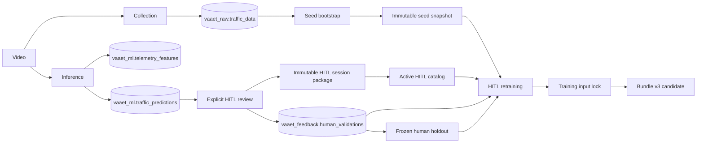

# Linaje de datos — VAAET ML 4.8.0

## Flujo operacional

Cada ejecución operacional de adquisición, entrenamiento o inferencia genera un
`pipeline_run_id`. La evaluación Champion--Challenger es read-only y no crea
ejecuciones ni persiste datos. Los
timestamps se persisten como `TIMESTAMPTZ` UTC; valores históricos sin zona se
interpretan como `America/Argentina/Buenos_Aires` durante la migración.
El mismo contrato se aplica en memoria, CSV, backups, paquetes y sintéticos:
`record_time` siempre es timezone-aware en UTC. La hora argentina se recupera
únicamente para las features circadianas y la presentación, sin alterar el
instante persistido.
`continuity_id` segmenta cada clip ante cambios de vista o huecos superiores a
90 segundos. Features, histéresis e incidentes reinician su memoria en ese
límite.

Desde 4.2.0 el UUID referencia `vaaet_ops.pipeline_runs`, que registra workflow,
estado, commit, contratos y conteos sin secretos. Cuando PostgreSQL es opcional,
el mismo contrato se conserva como JSON bajo `vaaet-ml/data/processed/pipeline-runs/`.

## Adquisición

`collect_traffic_telemetry.ipynb` produce video anotado, CSV raw y, al habilitarlo,
inserta exclusivamente en `vaaet_raw.traffic_data`. La unicidad
`(clip_id, record_time)` hace idempotente la repetición. No se persisten frames,
patentes ni identidades.

## Inferencia y revisión

`analyze_traffic_video.ipynb` persiste las 19 features y predicciones estables
0–2 con el perfil `inference`. Después del clip, una celda opcional abre una cola
`priority` o `all`; no interrumpe el procesamiento con pop-ups. El perfil
`review` agrega validaciones sin modificar predicciones. El modo `all` conserva la
validación previa como `supersedes_validation_id` al corregir. Accident requiere nota y
revisión explícita del contexto. Sin base disponible se exporta
un paquete inmutable `vaaet-training-dataset-v1.zip` por sesión. El paquete se
registra en `vaaet-dataset-catalog-v1`; los registros omitidos permanecen como no
supervisados y nunca son targets.
Cada predicción conserva `model_version` como etiqueta y `model_revision` como
SHA-256 del bundle exacto. Una reinferencia crea otra feature y predicción por
ejecución; no modifica la fila a la que apunta una validación humana.
Antes de formar ground truth, las fuentes PostgreSQL, backup y paquetes se
consolidan globalmente. Un único resolutor recorre las cadenas UUID, rechaza
ciclos, ramas y referencias cruzadas, y conserva todos los IDs de reinferencias
equivalentes. No se elige una fila sólo por tener la fecha más reciente.

## Entrenamiento

`TrainingIngestionPlan` declara uno de dos modos. El tipo nunca se infiere por
columnas:

- `SEED_BOOTSTRAP`: raw desde servidor, backup o CSV; auditoría, ingeniería de
  las 19 features, etiqueta proxy y paquete semilla reutilizable;
- `HITL_RETRAINING`: paquete semilla más feedback con feature schema compatible
  y última validación humana, sin recalcular features;
- estados humanos 0–2: candidatos al MLP;
- estado humano 3: evaluación del detector de incidente, nunca target del MLP.

La etiqueta humana prevalece sobre el proxy para el mismo minuto. La memoria
proxy decrece por clase al crecer el soporte humano y desaparece en los umbrales
documentados por ADR-0017. Conflictos
entre validaciones efectivas detienen el entrenamiento. Sintéticos sólo aparecen
en train y siempre permanecen identificados.

Con `HUMAN_HOLDOUT_FROZEN=True`, validation y test se materializan como
`vaaet-human-holdout-v2` bajo Google Drive. El snapshot conserva `continuity_id`,
`model_revision`, las features y
etiquetas exactas, mientras `current.json` selecciona la generación activa. Sus
grupos se excluyen de train; actualizar el benchmark crea una nueva generación
sin sobrescribir la anterior. PostgreSQL continúa siendo la autoridad del
feedback y el ZIP sólo representa la fotografía reproducible de evaluación.

## Evaluación read-only

`evaluate_models_and_eda.ipynb` valida los dos manifiestos y compara bundles
sólo con el ZIP del holdout compatible. No crea `pipeline_run`, no modifica DVC,
PostgreSQL, catálogos ni decisiones humanas de promoción.

## Artefactos de dataset e input lock

La semilla procesada vive bajo `data/seed-bootstrap/snapshots/` en Drive y
`current.json` apunta a una generación inmutable. Las sesiones HITL viven bajo
`data/hitl-reviews/YYYY/MM/DD/` y `catalog.json` selecciona paquetes `active`.
Antes de exportar el bundle, entrenamiento escribe `vaaet-training-input-lock-v1`
con el snapshot semilla, revisión exacta del catálogo, fingerprints de cada ZIP y
holdout utilizado. El lock aporta linaje reproducible; no contiene pesos ni
reemplaza PostgreSQL.

La exportación construye los cuatro archivos del bundle en un directorio
temporal, calcula `model_revision`, valida el manifiesto y sólo entonces
reemplaza de manera atómica la copia de trabajo seguida por DVC.
El algoritmo vigente incorpora también `input_policy`. Las revisiones con el
algoritmo anterior son sólo históricas y no habilitan persistencia, HITL o
promoción.
