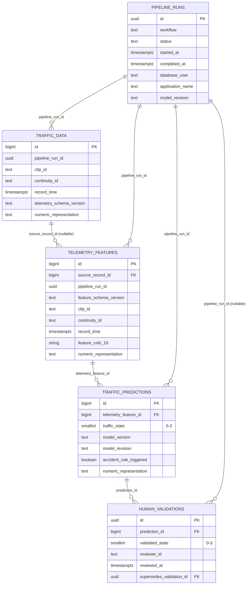

# Modelo PostgreSQL — `vaaet-db-v3`

VAAET Persistence 0.2.0 usa PostgreSQL 14+ y Alembic como única autoridad DDL. La
portabilidad por capacidades y la configuración administrativa se rigen por
[ADR-0024](decisions/0024-provider-neutral-postgresql-and-schema-as-code.md).
Los notebooks nunca crean ni alteran tablas. La revisión vigente encadena la
[migración base](../../vaaet-persistence/src/vaaet_persistence/migrations/versions/20260804_0001_postgres_schemas_hitl.py)
y el [hardening 4.2](../../vaaet-persistence/src/vaaet_persistence/migrations/versions/20260806_0002_postgres_hardening_pipeline_runs.py),
seguido por la [continuidad e identidad v3](../../vaaet-persistence/src/vaaet_persistence/migrations/versions/20260905_0003_temporal_continuity_model_revision.py).
La extracción está gobernada por [ADR-0028](decisions/0028-shared-postgresql-persistence-layer.md)
y la [revisión `0004`](../../vaaet-persistence/src/vaaet_persistence/migrations/versions/20260909_0004_numeric_fidelity_hitl_integrity.py)
implementa [ADR-0029](decisions/0029-postgresql-numeric-fidelity-and-hitl-consistency.md).

## Relaciones



## Contratos

| Objeto | Responsabilidad | Clave idempotente |
|---|---|---|
| `vaaet_raw.traffic_data` | Telemetría v3, continuidad y métricas de calidad | `(clip_id, record_time)` |
| `vaaet_ml.telemetry_features` | Fotografía inmutable de las 19 features por ejecución | `(pipeline_run_id, clip_id, record_time, feature_schema_version)` |
| `vaaet_ml.traffic_predictions` | MLP, política temporal y candidato de incidente | `(telemetry_feature_id, model_revision)` |
| `vaaet_feedback.human_validations` | Revisión humana append-only | UUID; sustitución explícita por FK |
| `vaaet_ops.pipeline_runs` | Ciclo redactado y auditable de cada workflow | UUID |

Todas las fechas son `TIMESTAMPTZ` UTC. Las medidas continuas, features y
probabilidades usan `DOUBLE PRECISION`, en paridad con `float64`; los conteos
continúan siendo enteros. `numeric_representation` distingue escrituras nuevas
`float64` de históricos `legacy-rounded` sin inventar precisión perdida.
`continuity_id` cambia por vista o por
huecos superiores a 90 segundos. `model_revision` es el SHA-256 del bundle
exacto y no reemplaza a la etiqueta semántica `model_version`. Los ratios están
restringidos a `[0,1]`,
conteos a valores no negativos y estados automáticos a `0–2`. El estado público
3 sólo puede existir en una validación humana que incluya nota y confirme que se
revisó el contexto temporal.

## Vistas

- `vaaet_feedback.review_queue`: predicciones con su nodo terminal válido; el modo
  `priority` excluye revisadas y `all` permite correcciones append-only.
- `vaaet_feedback.effective_human_labels`: único nodo terminal de cada cadena válida.
- `vaaet_feedback.human_validation_conflicts`: cadenas históricas ambiguas,
  preservadas pero excluidas del uso supervisado.
- `public.traffic_data`, `public.telemetry_raw` y
  `public.traffic_classifications`: compatibilidad read-only durante 4.x.

Las vistas `public` no son el contrato para código nuevo y se eliminarán en
5.0.0.

## Roles

| Rol de grupo | Permisos |
|---|---|
| `vaaet_collection_role` | SELECT/INSERT raw |
| `vaaet_inference_role` | SELECT/INSERT de features y predicciones inmutables |
| `vaaet_training_role` | SELECT en los tres schemas |
| `vaaet_reviewer_role` | SELECT de cola/predicciones e INSERT de validaciones |

El administrador aplica `alembic upgrade head` y
[`provision-roles.sql`](../../vaaet-persistence/src/vaaet_persistence/migrations/provision-roles.sql), luego crea usuarios
LOGIN específicos del proveedor y les concede un solo rol de grupo.

Las funciones `vaaet_ops.start_pipeline_run` y
`vaaet_ops.finish_pipeline_run` son la única escritura operacional disponible
para los workflows. Verifican membresía del rol y no aceptan metadata arbitraria.

## Normalización e índices

Las entidades operativas mantienen PK, FK y claves naturales. La tabla de
features es una excepción deliberada a 3FN: conserva el snapshot exacto usado
por cada versión para reproducibilidad ML. Códigos y etiquetas están unidos por
constraints, y los índices se limitan a claves naturales, ejecución, modelo y
resolución de la última validación.

No se aplicará particionamiento antes de diez millones de filas o de evidencia
medida mediante tamaño y planes. Alcanzado ese umbral se evaluarán particiones
mensuales por `record_time`.

## Backups

Backup canónico:

```bash
pg_dump --format=custom --no-owner --no-acl \
  --schema=vaaet_raw --schema=vaaet_ml --schema=vaaet_feedback --schema=vaaet_ops \
  --file=vaaet-db-v3.backup
```

El cliente toma endpoint, TLS y credenciales desde variables `PG*` temporales
preparadas por la identidad administrativa; la guía operativa muestra esa
conversión sin guardar un DSN en Git.

El importador inspecciona primero `pg_restore -l`, restaura únicamente tablas
VAAET explícitas a SQL temporal y nunca aplica roles ni DDL del backup contra una
base viva. Backups legacy con `public.traffic_data` siguen disponibles como raw.
