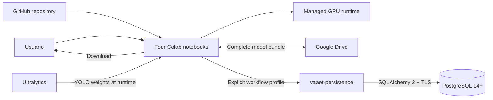

# Arquitectura Colab y PostgreSQL

Adquisición, entrenamiento e inferencia requieren una GPU gestionada; evaluación
es read-only. Las credenciales por perfil se leen directamente de Colab Secrets. `vaaet_raw`,
`vaaet_ml` y `vaaet_feedback` separan responsabilidades; la biblioteca
compartida centraliza las operaciones. Alembic y el administrador
nunca se ejecutan desde Colab. `/content` es efímero y la persistencia permanece
deshabilitada por defecto.
