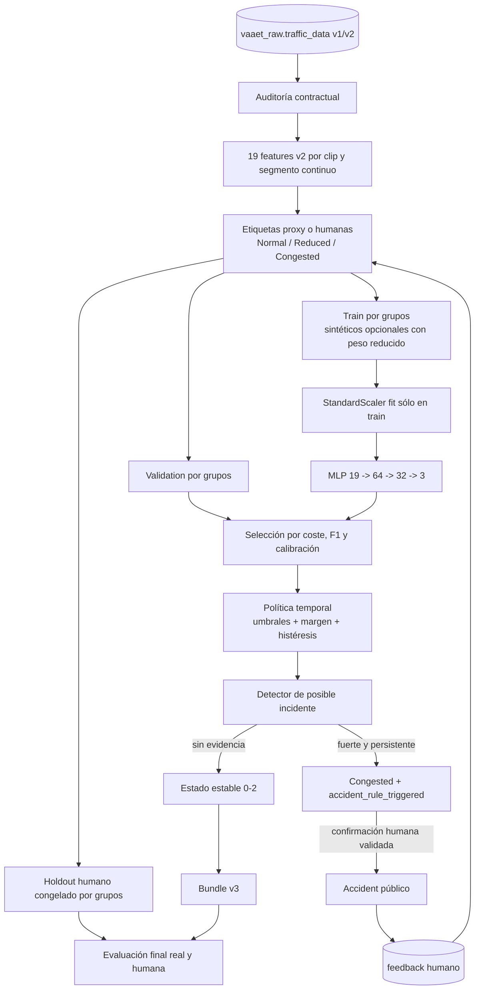

# Pipeline de entrenamiento e inferencia jerárquica

El MLP nunca emite `Accident`. Validation/test no contienen sintéticos y una ventana parcial no se clasifica. El bundle sólo es promovible cuando su manifiesto no contiene bloqueos.

## Bundle

| Archivo | Propósito |
|---|---|
| `traffic_classifier.keras` | MLP de tres salidas |
| `feature_scaler.joblib` | Scaler ajustado con train |
| `label_mapping.joblib` | Cuatro estados públicos |
| `model-manifest.json` | Contrato v2, política, métricas, procedencia y checksums |
