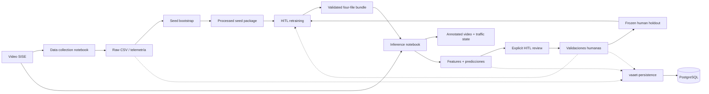

# Arquitectura de software — VAAET

VAAET separa un core operativo, una persistencia PostgreSQL compartida y un
laboratorio MLOps batch. Colab orquesta ejecuciones manuales; los imports son
`vaaet`, `vaaet_persistence` y `vaaet_ml`.

## Capas

| Capa | Ruta | Responsabilidad |
|---|---|---|
| Orquestación | `vaaet-ml/notebooks/` | UI Colab, selección de entradas y descargas |
| Core operativo | `vaaet-core/src/vaaet/` | Visión, telemetría, 19 features, estados, contratos e inferencia manifest-first |
| Persistencia | `vaaet-persistence/src/vaaet_persistence/` | Perfiles, engines, consultas, escrituras, auditoría y Alembic |
| Datos de laboratorio | `vaaet-ml/src/vaaet_ml/data/` | CSV/backups, snapshots, catálogo HITL, input locks y adaptadores Colab |
| Evaluación | `vaaet-ml/src/vaaet_ml/evaluation/` | Comparación, drift y reporting |
| Entrenamiento | `vaaet-ml/src/vaaet_ml/training/` | Modos seed/HITL, memoria proxy, holdout y balanceo |
| Features sintéticas | `vaaet-ml/src/vaaet_ml/features/` | Datos trazables exclusivamente de entrenamiento |

`vaaet.vision.analysis.analyze_video()` es el límite común entre adquisición e
inferencia. `TrafficStateEngine` encapsula la clasificación por minuto sobre un
bundle ya validado; no implementa I/O remoto, colas ni persistencia. Sin
proveedor de predicción muestra “Telemetry Collection”; con proveedor incorpora
estado y confianza. El módulo no importa TensorFlow.

Internamente, visión ejecuta filtros síncronos y ordenados:
`FramePacket → PerceptionPacket → TrackingPacket → MotionPacket → RenderedFramePacket`.
Una sesión por clip conserva el estado de flujo óptico, SORT, velocidad,
estacionario y telemetría; no hay colas ni workers entre filtros. Una cola local
acotada entre lectura y YOLO sólo será candidata tras comparar estas métricas
base con el mismo clip, GPU, modelo y resolución, sin alterar el orden ni la
telemetría.

`VideoAnalysisResult.metrics` expone `PipelineMetrics` inmutable: frames
procesados, tiempo total, FPS end-to-end y acumulados por etapa con reloj
monotónico. El core no mide RAM ni VRAM; cualquier benchmark de Colab debe
registrarlas fuera del contrato portable.

### Vistas y calibración local

Un `VideoViewPlan` opcional permite que un video offline declare tramos estables
de cámara o zoom mediante rangos de frames y perfiles `CameraCalibration`
versionados. Cada perfil usa referencias métricas conocidas a distintas
profundidades y el core interpola la escala sobre el contacto inferior de cada
vehículo. El plan no se lee desde el core: notebooks y futuros adaptadores lo
cargan localmente y fuera de Git/DVC.

Una transición reinicia flujo óptico, SORT, velocidad, estacionario y contexto
de clasificación. No hay reidentificación entre vistas. Un minuto que cruza una
transición se descarta en lugar de mezclar conteos o geometrías; los reportes de
segmento quedan en `VideoAnalysisResult.view_segments` sin alterar telemetría
v3 ni las 19 features. La guía operativa está en
[calibración multi-vista](../operations/multi-view-calibration-guide.md).

El notebook de entrenamiento expone dos entradas explícitas que convergen antes
del split: `SEED_BOOTSTRAP` calcula features desde raw y produce un piloto;
`HITL_RETRAINING` consume el snapshot semilla vigente y todos los paquetes activos
del catálogo HITL sin recalcular features. Antes del bundle registra la selección
exacta en un input lock. El mismo `input_policy` del manifiesto se usa en serving.

## Integraciones

- PostgreSQL es opcional y portable entre proveedores. `vaaet-persistence`
  centraliza su contrato para notebooks y futuros backends; cuatro perfiles
  aplican mínimo privilegio y cada proceso aporta su identidad.
- Google Drive transporta el bundle y conserva semilla, sesiones HITL, input locks y holdouts humanos entre sesiones Colab.
- DVC versiona el directorio `vaaet-ml/artifacts/traffic-state` como una unidad;
  Git identifica cada versión por commit o tag y cada entorno configura su
  remoto lógico `vaaet-registry` sin versionar proveedor ni credenciales.
- Los pesos YOLO se descargan en runtime y no pertenecen al repositorio.
- La futura Web App vivirá en `vaaet-app/`, consumirá únicamente una API
  versionada y nunca accederá directamente a bundles, DVC, Drive, PostgreSQL ni
  módulos Python. Los workers de API usarán `vaaet-core` y
  `vaaet-persistence`; el adaptador API será dueño de trabajos asíncronos,
  storage, contratos HTTP e identidad de servicio.

## Calidad

GitHub Actions cubre Python 3.10–3.13 y las tres distribuciones,
`pip check`, smoke imports, Ruff, pytest, compilación de los cuatro notebooks,
enlaces, DVC y ausencia de binarios ML en Git. GPU, Drive, videos reales y
PostgreSQL se validan manualmente en Colab.

Decisiones principales: [ADR-0021](decisions/0021-portable-core-and-ml-laboratory-boundary.md), [ADR-0024](decisions/0024-provider-neutral-postgresql-and-schema-as-code.md), [ADR-0026](decisions/0026-temporal-continuity-and-immutable-model-revisions.md), [ADR-0027](decisions/0027-complete-bundle-identity-and-hitl-integrity.md) y [ADR-0028](decisions/0028-shared-postgresql-persistence-layer.md).

Los diagramas complementarios están en el [índice de diagramas](diagrams/index.md).
