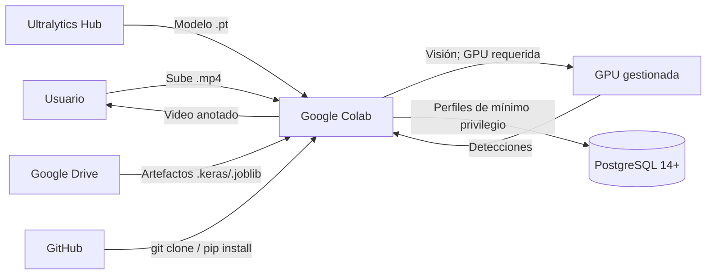

<!-- context: VAAET/docs/operations/deployment.md — Manual de despliegue.
Complementa USER_GUIDE.md y SAD.md. -->

# Manual de Despliegue (DevOps Playbook) — VAAET

## Identificación del Proyecto

| Campo | Detalles |
|---|---|
| **Nombre del Proyecto** | VAAET — Video Advanced Analysis of Traffic |
| **Versión** | 4.7.0 |
| **Estado** | Aprobado |
| **Responsable Técnico** | Facundo Nicolás González |
| **Última Revisión** | 2026-08-27 |

---

## 1. Arquitectura de Infraestructura

VAAET opera en un modelo "Notebook-as-Runtime": Google Colab es el entorno de
ejecución, cualquier proveedor PostgreSQL 14+ compatible puede proveer
persistencia opcional y Google Drive transporta artefactos.

### 1.1 Componentes del Sistema

| Componente | Tecnología | Responsabilidad |
|---|---|---|
| **Runtime** | Google Colab Free/Pro | Ejecución de notebooks sobre GPU gestionada cuando está disponible |
| **Código fuente** | GitHub | Versionado y CI/CD |
| **Base de datos** | PostgreSQL 14+ compatible | Raw, features, predicciones y HITL (opcional) |
| **Almacenamiento de modelos** | Google Drive / local | Artefactos `.keras` y `.joblib` |
| **Almacenamiento de video** | Local / Colab temporal | Videos de entrada y salida |

### 1.2 Diagrama de Infraestructura



---

## 2. Entornos de Ciclo de Vida

| Entorno | Plataforma | Propósito | Datos |
|---|---|---|---|
| **Desarrollo local** | Python 3.10–3.13 | Desarrollo y testing de core, persistencia y ML | Datos sintéticos, sin GPU |
| **Google Colab** | Colab Free/Pro | Ejecución manual de notebooks | Videos reales; GPU gestionada no garantizada |
| **CI** | GitHub Actions + PostgreSQL 17 | Validación automática | Tests puros y migración/grants reales, sin GPU |

---

## 3. Pipeline de CI/CD

### 3.1 Integración Continua (CI)

Se activa mediante **push** o **pull request** a `main`.

Pipeline definido en `.github/workflows/ci.yml`:

1. **Core**: instala `vaaet-core[vision,inference,dev]` y valida percepción,
   inferencia, Ruff y tests en Python 3.10–3.13.
2. **Persistencia**: instala core base y valida `vaaet-persistence` sin ML.
3. **Laboratorio ML**: instala core, persistencia y luego los extras ML.
4. **Integración**: instala los tres componentes desde el workspace y verifica sus
   imports y el bundle DVC de raíz.
5. **PostgreSQL**: instala core + persistencia, aplica migraciones en el servicio de
   prueba y ejecuta las pruebas marcadas `postgres`.
6. **Documentación**: verifica enlaces internos del monorepo desde la raíz.
7. **DVC**: instala `./vaaet-ml[dvc,dvc-gdrive,dvc-s3]` sobre core y persistencia,
   ejecuta `pip check`, `dvc doctor`, `dvc status` y `vaaet-registry --help`
   desde la raíz; no autentica ni transfiere bundles.

### 3.2 Despliegue (Manual)

VAAET no tiene despliegue automatizado ni infraestructura web. La operación de
laboratorio consiste en:

1. El usuario abre el notebook en Colab desde GitHub
2. La primera celda clona o actualiza el repo, resuelve extras sólo cuando
   cambian los `pyproject.toml`, refresca los tres paquetes locales sin reinstalar
   dependencias pesadas y ejecuta el preflight con `pip check`
3. Entrenamiento genera el bundle; inferencia lo valida antes de cargarlo

Ver la [guía de Colab](colab-guide.md) para Secrets, Drive y recuperación ante reinicios.

Una futura demo web que ejecute YOLO sólo podrá habilitarse por la vía pública
AGPL-3.0 con código reproducible y activos aprobados, o con una licencia
Ultralytics Enterprise para uso privado/comercial. Antes de cualquier
despliegue, completar el [checklist AGPL](../governance/agpl-demo-release-checklist.md)
y el [runbook temporal de AWS](aws-temporary-demo-runbook.md).

---

## 4. Procedimiento de Setup en Google Colab

### Primera celda — Setup del entorno

Ejecutá la primera celda del notebook sin añadir comandos manuales. Esta clona o
actualiza `/content/vaaet`, resuelve core, persistencia y ML, los instala con
los extras del workflow, limpia imports anteriores y valida sus orígenes.
El modo editable se reserva para desarrollo local.

## 4.1 Instalación local del monorepo

Desde la raíz, creá y activá una `.venv` con Python 3.10–3.13. Instalá siempre
core, persistencia y laboratorio en ese orden:

```bash
python -m venv .venv
# Activá .venv con tu shell.
python -m pip install --upgrade pip
python -m pip install -e "./vaaet-core[vision,inference,dev]"
python -m pip install -e "./vaaet-persistence[admin,dev]"
python -m pip install -e "./vaaet-ml[training,visualization,database,dev]"
python -m pip check
```

Para DVC local, instalá `python -m pip install -e
"./vaaet-ml[dvc,dvc-gdrive]"` o reemplazá `dvc-gdrive` por `dvc-s3` después del
core. Configurá el remoto local con `vaaet-registry configure ...`; no existe
un paquete instalable en la raíz ni se usan `requirements.txt` o lockfiles.

### Configuración de BD (opcional)

Definí el endpoint `VAAET_DB_*` y la credencial específica de cada perfil en
Colab Secrets, según la [guía de Colab](colab-guide.md). La identidad
administrativa local o CI usa el mismo endpoint más
`VAAET_ADMIN_DB_USER/PASSWORD`. No uses `getpass`, celdas con `os.environ` ni
un usuario compartido. El administrador aplica Alembic y grants fuera de Colab;
la [guía PostgreSQL](postgresql-guide.md) define las capacidades mínimas del
proveedor.

---

## 5. Gestión de Secretos

| Secreto | Mecanismo | Ubicación |
|---|---|---|
| Credenciales de BD | Colab Secrets por perfil | Runtime de Colab |
| Token de GitHub | Configuración de Colab | Secrets de Colab |

**Está estrictamente prohibido:**
- Hardcodear credenciales en código
- Imprimir credenciales en outputs de celdas
- Commitear archivos `.env` al repositorio

---

## 6. Estrategia de Base de Datos

### Migraciones

Alembic es la única autoridad DDL. Desde `vaaet-persistence`, ejecutá
`alembic -c alembic.ini upgrade head` con `VAAET_ADMIN_DB_USER/PASSWORD` y
después `src/vaaet_persistence/migrations/provision-roles.sql`. Los notebooks sólo comprueban el
contrato y fallan con un mensaje claro si la migración falta.

### Backups

- Backup administrativo de `vaaet_raw`, `vaaet_ml`, `vaaet_feedback` y `vaaet_ops`
- Script de conversión: `vaaet-ml/scripts/convert-postgres-backup.py`
- Configurar backups automáticos, retención y restauraciones probadas en el proveedor

---

## 7. Monitoreo y Resolución de Problemas

### Indicadores de Salud

| Indicador | Rango Normal | Acción si Anormal |
|---|---|---|
| `speed_measurement_quality` | > 0.70 | Revisar calidad del video, verificar flujo óptico |
| `rejected_speed_count` por minuto | < 30% del total | Verificar calibración de `pixels_per_meter` |
| F1-macro del clasificador | ≥ 0.88 sobre holdout humano apto | Revisar gates y reentrenar con evidencia nueva |

### Procedimiento de Rollback

En caso de error en los artefactos del modelo:
1. Restaurar artefactos previos desde Google Drive
2. Verificar F1-macro con el dataset de test
3. Si no hay backup, re-ejecutar el workflow de entrenamiento completo

---

## 8. Checklist de Despliegue

- [ ] Core y ML pasan sus pruebas, Ruff y `pip check` desde instalaciones locales
- [ ] Notebooks compilan sin errores de sintaxis
- [ ] Bundle v3, si existe, fue validado manifest-first antes de cargarlo
- [ ] Secretos PostgreSQL están configurados por perfil fuera de Git, si se habilita persistencia
- [ ] Drive/DVC se usan sólo para activos aprobados; no se asumen como infraestructura de serving
- [ ] Documentación actualizada si hay cambios en features o flujo

---

Responsable del documento: Facundo Nicolás González
Fecha de revisión: 2026-08-27
